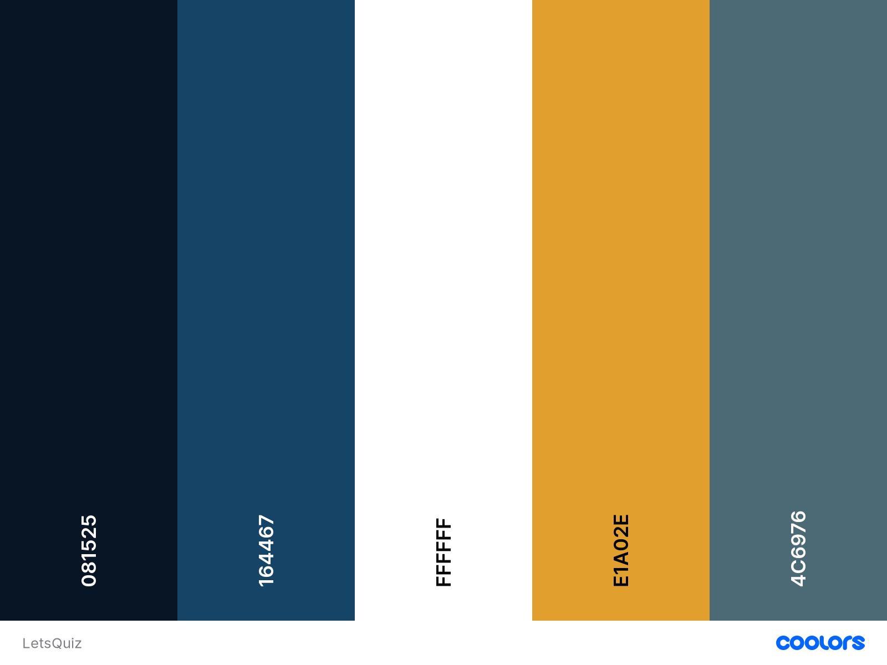

# **LetsQuiz**

## **Goal for this project** 
LetsQuiz is a fun an challenging quiz game, where you will get points for each correct answer you get. The questions will be of varied difficulty, but all of general knowledge. See if you can hit the top of the list! 

Thank you for visiting my project!
If you have any feedback or questions, head over to my GitHub contact details and feel free to reach out to me.

---

## Table of contents 

## **UX**

### **User Stories**

#### **User**
* As a user i want to be entertained by the game i am playing.
* As a user i want to be able to see how well i did compared to others.
* As a user i want to be able to learn new things, by playing the game.
* As a user i want to see the rigth answer to the question, when i have answered.
* As a user i want to be able to contact the owner, if i have anything to ask about.

#### **Owner** 
* As a owner i want people to strenghten their general knowledge.
* As a owner i want people to easily follow how to play the game.
* As a owner I want the game to be entertaining.
* As a owner I want people to play more than one round of the game. 

### **User Expectations**
* Easy to navigate.
* Flow of the sign up process takes a short time.
* Understand the purpose of the webiste within a short time.
* Be able to complain if any issues occure.

[Back to Top](#table-of-contents)

### **Design Choices**

#### **Fonts**
 I have visited [Google Fonts](https://fonts.google.com/ "Google Fonts") to explore the various options. The fonts used in this project are [Raleway] (https://fonts.google.com/specimen/Raleway) for the overall text and [Fira Sans] (https://fonts.google.com/specimen/Fira+Sans#standard-styles) for the headlines. The fonts have a light readthrough and do not come of as strong to the eye. It goes well in line with the hip and light design of the website. 

#### **Icons**
I have used icons from the [Font Awesome library](https://fontawesome.com/ "Font Awesome"). The icons fit with the corresponding features that the users of the website are to understand. The visual aspect will make it easier to make a fast intepretation of what the text is about.

#### **Colors**

You can view my color scheme [here](assets/images/colors.png)

The colors are inspired by the colors from Who Want To Be a Millionaire. Here is a description of the colors: 

* #081525: Will be the background color of the website. It has a dark blue tone to it, illustrating the misterious in a quiz. 

* #164467: Is a more light blue color. It will be used for the tabs of the answers. This is to keep consistency, but still keep the tone of the page.

* #FFFFFF: The white color will be used in various places as contrast. 

* #E1A02E: The orange color is also inspired by Who Wants To Be a Millionaire. It will be used as the text color, and has a good contrast to the Dark Blue. 

* #4C6976: Is a Teal color that goes well with the other blue colours. It will be used for the scoring board and tutorial. 

I have used to contract checker on Coolors in order to make sure that the contract is sufficient.
This way my content will be easily readable. 

#### **Changes made to color scheme**

#### Structure
The website structure is built with [Bootstrap](https://getbootstrap.com/).
Bootstrap provides content for both CSS and JavaScript, as functionality with both is important.
As Bootstrap is designed for mobile first, I will be certain that my website functions well on mobile. 

[Back to Top](#table-of-contents)

--- 

## Wireframes
I have decided to use [Balsamic](https://balsamiq.com/wireframes/) to create wireframes for my website. 
First I created a wireframe for mobile, as the approach is mobile first. Thereafter wireframes for desktop and tablets. 

### Changes made to wireframes 

You can find my wireframes below:

### [Desktop Wireframes]
    ()

### [Tablet Wireframes]
    ()

### [Mobile Wireframes]
    ()

[Back to Top](#table-of-contents)

---

## Features

### Existing Features

#### Navigation

#### Hero Image

#### Welcome Section

#### About us Section

#### Meet the team

#### Contact 

#### Footer

### Features to be implemented

[Back to Top](#table-of-contents)

## Technologies used

### Languages

* [HTML](https://en.wikipedia.org/wiki/HTML)
* [CSS](https://en.wikipedia.org/wiki/Cascading_Style_Sheets)
* [JavaScript](https://en.wikipedia.org/wiki/JavaScript)

### Libraries & Frameworks

* [Font Awesome](https://fontawesome.com/)
* [Bootstrap](https://getbootstrap.com/)
* [Google Fonts](https://fonts.google.com/)

### Tools
* [Git](https://git-scm.com/)
* [GitPod](https://www.gitpod.io/)
* [Balsamic](https://balsamiq.com/wireframes/)
* [W3C HTML Validation Service](https://validator.w3.org/)
* [W3C CSS Validation Service](https://jigsaw.w3.org/css-validator/)

[Back to Top](#table-of-contents)

## Bugs

[Back to Top](#table-of-contents)

## Testing

### A first time visitor to this website

#### User story: 
* **Plan** 

* **Implementation**

* **Test**    

* **Result**  

* **Verdict**  

#### User story: 
* **Plan** 

* **Implementation**  

* **Test** 

* **Result** 

* **Verdict** 

#### User story: 
* **Plan** 

* **Implementation**

* **Test**  
 

* **Result** 

* **Verdict**  

#### User story:
* **Plan** 

* **Implementation** 

* **Test**   

* **Result**

* **Verdict**    

#### User story: 
* **Plan** 

* **Implementation**  

* **Test** 

* **Result** 

* **Verdict**     

[Back to Top](#table-of-contents)

## Bugs 

### 1

### 2

### 3

[Back to Top](#table-of-contents)

## Deployment

I deployed my Ways project website in the following way:

* Logged in to my GitHub account and locating my repository
* Clicked on the settings icon (near the top right of the page)
* Scrolled down the page to locate the 'GitHub Pages' section
* Under "Source", select "Master" in the dropdown menu.
* In the tab next to "Source", select "/root" if not already selected by default
* Click save then the page will automatically refresh.
* The link should show in a banner just above "GitHub Pages" section.
* This deployed my project to the URL: ()

[Back to Top](#table-of-contents)

## Credits

### Content - Media - Inspiration

### Acknowledgements

[Back to Top](#table-of-contents)

